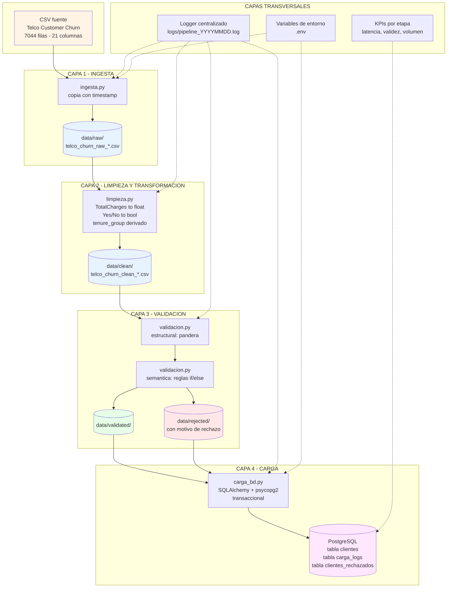
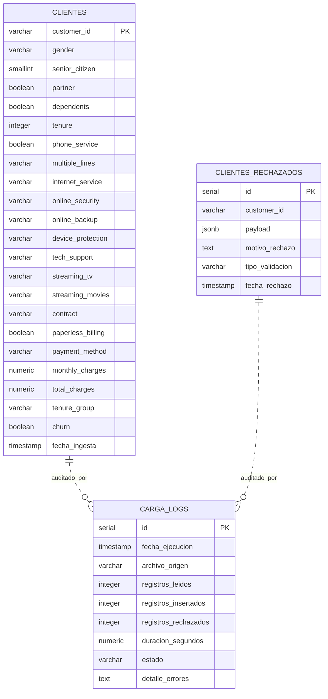
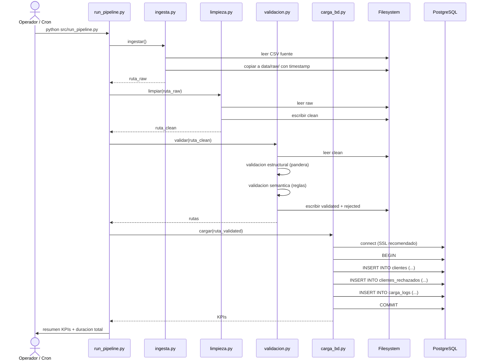
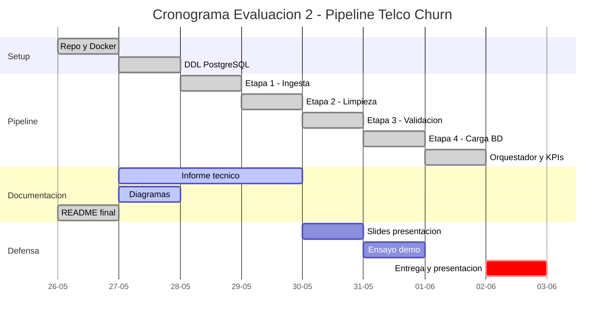

# Diagramas del proyecto

Estos diagramas se renderizan en GitHub directamente (Mermaid nativo). Para exportarlos como PNG ver instrucciones al final.

---

## 1. Arquitectura del pipeline (vista por capas)

---

## 2. Diagrama de Flujo de Datos (DFD) - Nivel 0

```mermaid
flowchart LR
    SRC([CSV Fuente<br/>Telco Churn]):::ext

    P1[1. Ingestar]:::proc
    P2[2. Limpiar y<br/>Transformar]:::proc
    P3[3. Validar]:::proc
    P4[4. Cargar a BD]:::proc

    D1[(D1: Raw)]:::store
    D2[(D2: Clean)]:::store
    D3a[(D3a: Validated)]:::store
    D3b[(D3b: Rejected)]:::store
    D4[(D4: Postgres<br/>clientes)]:::store
    D5[(D5: Postgres<br/>carga_logs)]:::store

    ANL([Analista de Datos<br/>modelo IA Eval 3]):::ext

    SRC -->|datos crudos| P1
    P1 -->|csv con timestamp| D1
    D1 --> P2
    P2 -->|datos normalizados| D2
    D2 --> P3
    P3 -->|registros validos| D3a
    P3 -->|registros invalidos + motivo| D3b
    D3a --> P4
    D3b --> P4
    P4 -->|inserts transaccionales| D4
    P4 -->|metricas ejecucion| D5
    D4 -->|consulta para entrenamiento| ANL

    classDef ext fill:#fff4e6,stroke:#d68910,stroke-width:2px
    classDef proc fill:#d4e6f1,stroke:#2874a6,stroke-width:2px
    classDef store fill:#d5f5e3,stroke:#1e8449,stroke-width:2px
```

---

## 3. Modelo Entidad-Relación de la base de datos

> Nota: las relaciones son logicas (por fecha_ejecucion), no por FK directa. Esto simplifica la carga masiva y permite re-cargas.

---

## 4. Secuencia de ejecucion del pipeline

---

## 5. Gantt / Cronograma del proyecto (3 semanas)

---

## Como exportar a PNG para el informe PDF

Opciones:
1. **GitHub** - sube el repo y abre `docs/diagramas.md`, GitHub renderiza Mermaid nativamente. Screenshot.
2. **Mermaid Live Editor** - copia el bloque mermaid a https://mermaid.live, exporta PNG.
3. **VS Code** - extension "Markdown Preview Mermaid Support" + screenshot.
4. **CLI** - `npm install -g @mermaid-js/mermaid-cli` y `mmdc -i diagramas.md -o arquitectura.png`.

Para el informe PDF necesitan exportar mínimo:
- Diagrama 1 (arquitectura)
- Diagrama 2 (DFD nivel 0)
- Diagrama 3 (modelo BD)
- Diagrama 5 (Gantt)
